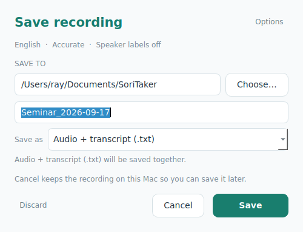
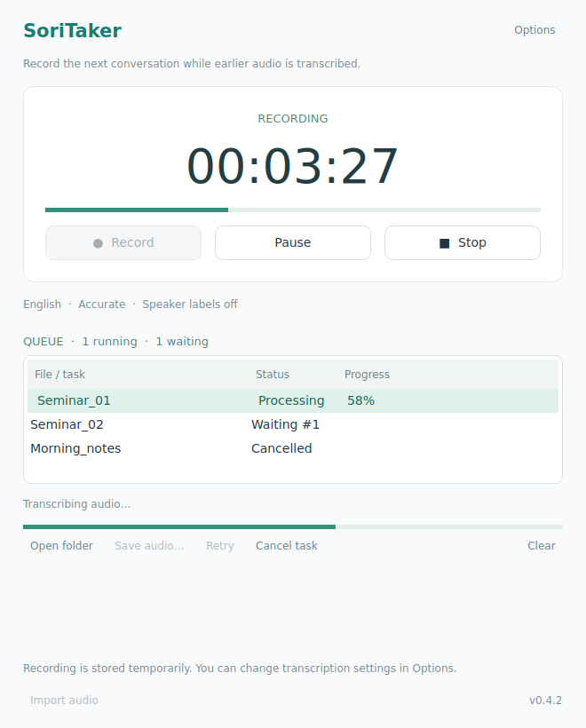

<p align="center"></p>

# SoriTaker

A small offline recorder and transcription app for Apple Silicon Macs.
Record, pause, choose what to keep, and save audio with an optional Korean or
English transcript. The interface, installer messages, diagnostics, and developer
documentation are in English. The Korean language option uses its native label.

**Version: 0.4.2 · Early personal-use release**


## Features

- Record from your microphone with Pause, Resume, and Stop controls.
- Start another recording while earlier audio is transcribed in the background.
- See waiting, processing, and failed tasks in a persistent queue; successful tasks disappear automatically.
- Open the save dialog directly with Stop, with no separate Save button on the main screen.
- Choose language, model, and speaker mode before recording.
- Change transcription settings during recording, while paused, or after Stop.
- Save audio only, save audio with a TXT transcript, or discard the current task.
- Group TXT output by sentence punctuation instead of short decoder fragments.
- Use a single-speaker lecture mode or optional speaker labels for meetings.
- Import existing audio or video files, including by drag and drop.
- Run transcription locally after downloading the selected models once.

There is no account requirement or monthly usage quota in the app. Transcription
is queued when you choose to save a transcript. An earlier recording can be
transcribed while you capture the next one; model workers run one at a time.

## Requirements

- Apple Silicon Mac running macOS Sonoma 14 or later.
- About 15–20 GB of free disk space for the initial installation and build.
  Actual usage varies with dependencies and selected models.
- Internet access for the initial installation and additional model downloads.
- macOS Command Line Tools for building the app locally.

This is a source installation package. The installer builds and checks the app
on your Mac. See [VALIDATION.md](VALIDATION.md) for the distinction between the
checks completed in development and native Mac behavior that still needs testing.

## Install

1. On GitHub, select **Code → Download ZIP** and extract it. The default branch
   archive normally extracts to `SoriTaker-main`.
2. Open Terminal, type `bash ` (including the space), drag `Install.command`
   from the extracted folder into Terminal, and press Enter. For the default
   Downloads location, the equivalent command is:

   ```bash
   bash "$HOME/Downloads/SoriTaker-main/Install.command"
   ```

3. If macOS asks you to install Command Line Tools, finish that installation,
   then run the command again.
4. Wait while the installer prepares a dedicated Python environment, installs
   dependencies, downloads the Fast and speaker-label models, and builds the app.
5. The app opens from `~/Applications/SoriTaker.app`. Keep it in the Dock if desired.

If you received the separately packaged `SoriTaker.zip`, its folder is named
`SoriTaker` instead. The drag-and-drop command works with either package, including
folders renamed by Finder when a previous download already exists.

The installer uses an app-specific environment under
`~/Library/Application Support/SoriTaker/installation/`. It does not modify your
existing Homebrew, Conda, or Python environments and does not use sudo.

If a model download fails, setup can still finish. Retry the missing model from
**Options → Download** when you have internet access. If the app build or its
self-check fails, the installer logs the failure and keeps the existing app.

## Update an existing installation

1. Quit SoriTaker (or the previous SoriNote app) completely with **Command-Q**.
2. Download and extract the latest source ZIP.
3. Type `bash ` in Terminal, drag `Update.command` from the **newly extracted
   folder**, and press Enter. For the default GitHub ZIP location:

   ```bash
   bash "$HOME/Downloads/SoriTaker-main/Update.command"
   ```

For `SoriTaker.zip`, use its `SoriTaker` folder instead. Always use the newly
downloaded update script, rather than one left in an older extracted folder.

The update reuses the existing Python environment, libraries, and models. It
does not install packages or download models. It preserves recordings, saved
transcripts, settings, and model files, then rebuilds and checks the app before
replacing it. The previous app is kept at
`~/Applications/SoriTaker-backup-TIMESTAMP-PID.app` (or `SoriNote-backup-…`
when updating the old app).

Rebuilding still takes time and temporary disk space. If the existing environment
or build tools are missing, the update stops instead of installing them. The new
app opens as **SoriTaker** when the update finishes. Add the new app to the Dock.

Existing SoriNote installations keep using `~/Library/Application Support/SoriNote/`
for recordings, settings, models, logs, and the installed Python environment.
The app and updater detect this folder automatically; no files need to be moved
and no models need to be downloaded again. Fresh installations use the SoriTaker
folder. The old app is backed up only after the new build passes its checks.

## Record and save

1. Click **Record**. Choose Language, Transcription model, and Speakers in the
   **New recording** dialog, then click **Start recording**. Allow microphone
   access when macOS asks. Cancel closes the dialog without recording.
2. Use **Pause / Resume** as needed. Paused audio is excluded from the recording.
3. Click **Stop**. Once the recording file is finished, the **Save recording**
   dialog opens automatically. Transcription does not start until you confirm.
4. In that dialog, use **Choose…** to pick a destination folder and edit the file
   name. **Options** lets you change the transcription settings before saving.
5. Choose **Save as**, then confirm with **Save** in the dialog:
   - **Audio + transcript (.txt)** queues local transcription and saves both files.
   - **Audio only (no transcription)** queues a copy of the original file without loading
     a model, transcribing, or converting its format. No models are required.
6. The dialog closes as soon as the task is queued, so you can start the next
   recording immediately. Successful tasks disappear from **Queue** after their
   files finish saving. The version is shown at the bottom right of the main
   screen. Saved output paths are also available in the completion message tooltip.



**Cancel**, Escape, or closing the save dialog keeps the unsaved audio. Click
**Review recording** to reopen it with the same filename and choices. Imported
files and **Save audio…** open this dialog too. An unsaved microphone recording
is offered again after relaunch. There is no Save button on the main screen.

Example output from a microphone recording:

```text
Seminar_2026-09-14.wav
Seminar_2026-09-14.txt
```

Microphone recordings are WAV files. Imported M4A, MP3, and other supported audio
files retain their format. When transcribing a video, the app extracts WAV audio;
in Audio only mode it copies the imported file itself. Name collisions add `(2)`,
`(3)`, and so on, preserving existing files. Transcript timestamps refer to the
saved audio, with paused intervals excluded.

### Discard or cancel

**Discard** asks for confirmation before deleting the current unsaved recording
and its temporary transcript and work files. Other recordings and already saved
results are preserved. For an imported file, Discard removes app-owned work and
keeps the external original. The save dialog closes after a confirmed discard.

Select a waiting or processing task in **Queue** and click **Cancel task** to stop
that task. Cancellation preserves its audio and does not stop a new recording.
Use **Retry** to run the same task again, or **Save audio…** to bring the recording
back to the save dialog and choose audio-only saving or different settings.

## Background queue



Confirming **Save** in the save dialog adds one task with its own audio source, output filename,
destination, language, model, speaker mode, and vocabulary hints. Those settings
are fixed for that task. Changing Options or the save folder for a later recording
does not change jobs already in the queue.

The recording screen becomes available as soon as the task is queued. Press
**Record** to start the next recording, even while an earlier task is processing.
Transcription and model-download workers run sequentially to limit memory usage;
waiting tasks start automatically, including while the microphone is recording.
Audio-only saves also use the queue and do not load a model.

The queue shows unfinished tasks' status, waiting position, and reported progress.
Successful tasks disappear only after output saving is confirmed; a reported 100%
alone does not remove a task. The queue panel hides when nothing remains. Saved
audio, transcripts, and completion receipts stay on disk, and completed tasks do
not reappear after relaunch. A short completion message (including any recognition
warnings) remains below the queue.

Select a task to see its message. **Open folder** opens that task's job folder
when investigating unfinished work. **Cancel task** affects only the selected task.
Failed, cancelled, and interrupted tasks stay available for recovery until you
click **Clear**. Clear removes all finished entries from the list, including
cancelled and failed tasks; it leaves waiting, running, and cancelling tasks alone.
Cleared entries remain hidden after relaunch. Audio, exports, logs, and completion
receipts are preserved in their existing locations. App-owned audio for a cleared
unfinished task remains under the app data folder at `jobs/<task-id>/recording.wav`
and can be imported again. The next waiting task can continue without a popup
interrupting a new recording.

**Retry** puts a failed, cancelled, or interrupted task at the back of the queue
with its saved settings. **Save audio…** opens the preserved source in the save
dialog with **Audio only** selected. You can choose a destination and filename,
or switch to audio + transcript. It is available while recording is stopped.

Closing the app asks before stopping capture and active work. Waiting tasks remain
on disk and resume on the next launch. An interrupted task is kept for manual retry;
its unfinished transcription restarts from the beginning. A stored completion
receipt prevents a task that already finished saving from being exported again.
Hardware recording quality while using the GPU still needs testing on your Mac.

## Settings


**Options** stays available during recording, while paused, and after Stop.
Change the language, model, speaker settings, or vocabulary hints, then click
**Done**. The settings in effect when you press **Save** apply to that entire
recording. Initial choices in the recording dialog can be changed later, and
Options can be edited while a previous recording is being transcribed.

Opening Options preserves the current recording or pause state. The microphone
is fixed during recording. Microphone changes and model downloads are available
after Stop. Settings already captured by a queued task remain fixed.

| Setting | Behavior |
| --- | --- |
| Language | Korean, English, or Auto-detect. Automatic detection estimates the recording's primary language. |
| Fast · Large v3 Turbo | Default transcription model; approximately 1.6 GB. |
| Accurate · Large v3 | Optional model; approximately 3.1 GB. Compare results on your own recordings. |
| Single speaker / lecture | Skips speaker identification and speaker labels. Default initial recording mode. |
| Multiple speakers / meeting | Enables speaker identification. Configure a known speaker count in Options if available. |
| Speaker labels | Optional speaker identification. A count of 1 skips additional speaker inference. |
| Vocabulary hints | Optional terms from your slides or notes, such as scientific names and abbreviations. Spelling is not guaranteed. |
| Microphone | Select an input device while stopped. The app uses the system default again after relaunch. |

Speaker mode is remembered for the next recording. To process an existing lecture,
use **Import audio**, select its language in **Options**, turn **Speaker labels**
off, and save with a transcript.

### Sentence formatting and accuracy

TXT output joins short recognition fragments at sentence punctuation. Where word
alignment covers the complete text, it also separates multiple sentences inside
one segment and uses the first word's timestamp. Speaker changes and long pauses
keep separate blocks. SRT/VTT export helpers retain the original segment timing.

Punctuation and alignment errors can prevent exact sentence boundaries. Formatting
does not rewrite recognized words or invent missing content. Already saved TXT
files are not changed automatically by an update.

Scientific terms, accents, background noise, quiet speech, overlapping speakers,
and frequent Korean/English switching can cause recognition errors. Automatic
speaker identification can split one voice into several labels. The speaker
embedding model is based on English speaker data; accuracy on Korean meetings
needs separate validation. Neither accuracy nor speed has been established as
equivalent to CLOVA Note.

## Temporary files and recovery

For a fresh installation, unsaved recordings are kept at:

```text
~/Library/Application Support/SoriTaker/recordings/
```

Upgrades from SoriNote continue using the same paths under `SoriNote/`.

On relaunch, the app recovers the most recent unqueued recording. Use **Import
audio** to open other recordings from that folder. Queued microphone recordings
move into their own `jobs/<id>/recording.wav` files so a later recording cannot
replace or discard them. Failed and cancelled tasks keep their audio there.
Successful saves clean up only that task's temporary recording and working files.
External imported originals are preserved.

| Data | Location |
| --- | --- |
| Installation logs and app checks | `~/Library/Application Support/SoriTaker/logs/` |
| Queue state, queued audio, and processing logs | `~/Library/Application Support/SoriTaker/jobs/` |
| Local models | `~/Library/Application Support/SoriTaker/models/` |

If recording fails, check **System Settings → Privacy & Security → Microphone**
and allow SoriTaker. Relaunch the app if needed. You can select another input in
Options while stopped, or import an existing file to check transcription.

For setup failures, include the final Terminal error and the installation log when
reporting the problem. Re-running setup reuses completed model downloads.

### Model download reports that offline mode is enabled

Version 0.3.3 removes the forced offline environment settings that blocked model
downloads. It also clears flags inherited from older releases before loading the
Hub client. Apply the latest `Update.command`, then retry **Options → Download**
for **Accurate · Large v3**.

The Accurate model download requires internet access and approximately 3.1 GB of
model storage. Transcription uses the installed model directory locally, without
uploading recordings. No offline switch is needed: once the models are installed,
transcription works without an internet connection. Missing models are reported
in the app; transcription does not download them automatically.

## Development

The source is in `src/`. The app uses PySide6 for the GUI, Apple MLX and
mlx-whisper for recognition, sherpa-onnx with pyannote segmentation and NeMo
TitaNet small for speaker identification, and the FFmpeg binary distributed by
imageio-ffmpeg for audio conversion.

With the required dependencies installed, run the tests from the project folder:

```bash
PYTHONPATH=src QT_QPA_PLATFORM=offscreen python3 -m unittest discover -s tests -v
python3 tests/check_update_script.py
```

The update-script checks simulate Mac build commands; they do not perform a
native Mac build. See [VALIDATION.md](VALIDATION.md) for detailed coverage and
limitations. Code comments and documentation are in English; Korean test fixtures
exercise Unicode text and Korean transcription handling.

## Recent changes

- **0.4.0:** Record new audio while prior tasks are processed. Add a persistent
  serial queue with status, cancellation, retry, audio recovery, and output-folder
  access. Freeze settings per task and isolate temporary audio and cleanup.
  Use general Apple Silicon descriptions and the package name `SoriTaker.zip`.

- **0.3.4:** Add a teal rounded-square app icon combining a written note with a
  sound waveform. Include the macOS ICNS icon and the GUI PNG in installation
  and update builds; no new dependencies or model downloads are needed.

- **0.3.3:** Rename the app to SoriTaker while reusing SoriNote data and models.
  Remove forced offline settings and clear legacy flags that blocked model downloads;
  transcription continues to load local model files.
- **0.3.2:** English installation, update, diagnostic, and error messages; English
  README; native Korean label in language selectors.
- **0.3.1:** Options can be changed during recording and pause; Save uses the
  latest transcription settings.
- **0.3.0:** Sentence-oriented TXT output and explicit lecture/meeting modes.
- **0.2.0:** Recording setup dialog, audio-only saving, scoped discard, and an
  offline updater that reuses the existing environment.

## License

See [LICENSE](LICENSE) and [THIRD_PARTY_NOTICES.md](THIRD_PARTY_NOTICES.md) for
licenses and component attribution.
